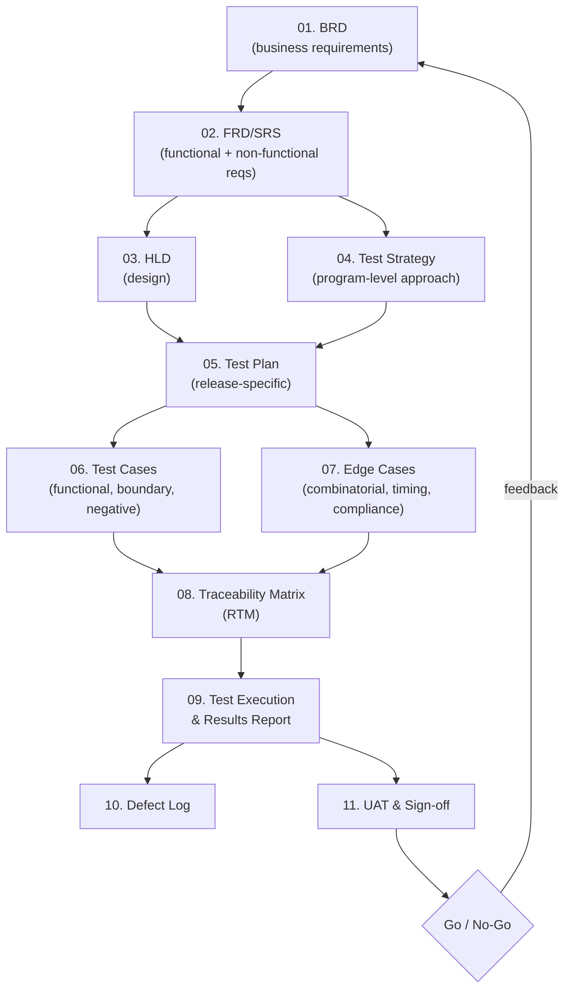

# Enterprise SDLC Framework — Worked Example: Loan Evaluator

This repository is a complete, traceable SDLC/STLC artifact set built
end-to-end for a realistic system — a **Loan Evaluator**: an automated
underwriting pre-screening engine that scores DTI, LTV, credit tier, and
employment history and returns an explainable risk recommendation.

It's meant as a **template you can copy for your next project** — the
structure, ID scheme, and traceability discipline are the reusable part;
the loan-specific business rules are the worked example that makes every
document concrete instead of generic.

## How to read this repo

Start at the top and follow the numbered folders in order — each stage
consumes the one before it, and everything traces back to a Business
Requirement (`BR-xx`) via a Functional/Non-Functional Requirement
(`FR-xx`/`NFR-xx`) via a Test/Edge Case (`TC-xxx`/`EC-xxx`). The
Requirements Traceability Matrix ties it all together in both directions.

| Folder | Artifact | Answers |
|---|---|---|
| `loan-evaluator/01-business-requirements/` | BRD | *Why are we building this, and what does the business need?* |
| `loan-evaluator/02-requirements/` | FRD/SRS (functional + non-functional) | *What, precisely, must the system do — with numbers, not adjectives?* |
| `loan-evaluator/03-design/` | HLD | *How is it architected to meet those requirements?* |
| `loan-evaluator/04-test-strategy/` | Test Strategy | *What is our overall approach to quality, org-wide?* |
| `loan-evaluator/05-test-plan/` | Test Plan | *What are we testing, when, with what resources, this release?* |
| `loan-evaluator/06-test-cases/` | Test Cases (`.md` + `.csv`) | *What specific inputs/outputs prove each requirement works?* |
| `loan-evaluator/07-edge-cases/` | Edge Case Catalog | *What breaks a naive implementation — boundaries, races, malformed data, compliance traps?* |
| `loan-evaluator/08-traceability/` | RTM (`.md` + `.csv`) | *Is every requirement tested, and is every test justified by a requirement?* |
| `loan-evaluator/09-test-execution/` | Execution Summary Report | *What actually happened when we ran it — pass/fail, coverage, go/no-go?* |
| `loan-evaluator/10-defects/` | Defect Log | *What went wrong, and is it fixed?* |
| `loan-evaluator/11-uat-and-signoff/` | UAT & Sign-off | *Does the business agree this is ready to ship?* |
| `SDLC-GAP-ANALYSIS-AND-ENHANCEMENTS.md` | Gap analysis | *What's missing from this lifecycle, and what should a modern team add?* |

## ID scheme (reused across every document)

| Prefix | Meaning |
|---|---|
| `BO-x` | Business Objective |
| `BR-xx` | Business Requirement |
| `FR-1xx` | Functional Requirement |
| `NFR-2xx` | Non-Functional Requirement |
| `TC-xxx` | Test Case |
| `EC-xxx` | Edge Case |
| `RF-x` | Red-flag business rule (domain-specific to this example) |
| `DEF-xxx` | Defect |
| `UAT-xx` | UAT Scenario |

## Adapting this to a different project

1. Keep folders 01–11 and the RTM discipline — that structure is domain-agnostic.
2. Replace the business rules in `02-requirements/` with your own; keep the
   pattern of "every FR states an exact, testable rule with numbers,"
   not prose.
3. Re-derive `06-test-cases` and `07-edge-cases` from your new FRs using
   the same techniques (equivalence partitioning, boundary value
   analysis, decision tables, negative testing) documented in
   `04-test-strategy/Test-Strategy.md` §3.
4. Read `SDLC-GAP-ANALYSIS-AND-ENHANCEMENTS.md` before you consider the
   lifecycle "done" — most real-world gaps aren't in the test cases,
   they're in the phases teams skip entirely.
