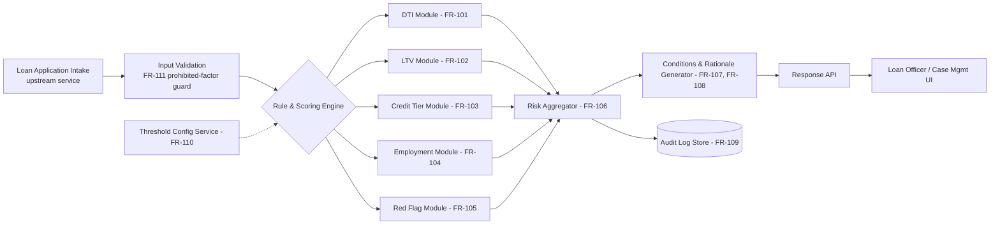

# High-Level Design (HLD)
## Project: Loan Evaluator

| Field | Value |
|---|---|
| Doc ID | HLD-LE-001 |
| Version | 1.0 |
| Traces to | FRD-LE-001 |

## 1. Architecture Overview

## 2. Component Notes

- **Rule & Scoring Engine**: stateless, pure-function modules per FR-101–FR-105 so each is independently unit-testable against the boundary values defined in the FRD.
- **Threshold Config Service**: versioned key-value store (`loan_type` × jurisdiction → thresholds); every evaluation pins the `ruleset_version` it used (NFR-208, FR-110).
- **Audit Log Store**: append-only; write path is on the critical path of every evaluation — a failed audit write fails the evaluation (BR-10 is non-negotiable, not best-effort).
- **Response API**: synchronous REST/JSON per the input/output contracts in FRD-LE-001 §1–2.

## 3. Key Design Decisions

| Decision | Rationale |
|---|---|
| Deterministic rules engine, not ML, for v1 | Satisfies NFR-205 explainability and BR-09 adverse-action rationale without a model-risk-management program; ML scoring is a candidate for a later phase once bias-testing tooling (see gap analysis) is in place. |
| Hard ceiling of "Refer for Manual Underwriting" (no auto-decline) | Enforces BR-11 / ECOA compliance at the architecture level, not just policy. |
| Audit write is synchronous and blocking | Prevents any evaluation from existing without an audit record (BR-10). |
| Thresholds externalized to config service | Enables BR-12 (jurisdictional variation) without redeploying the rules engine, and gives Risk Management a controlled, approved change path (NFR-208). |

## 4. Out of Scope for HLD
Credit bureau integration, document management, and case management UI are separate systems this service is consumed by; only the API contract with them is in scope here.
